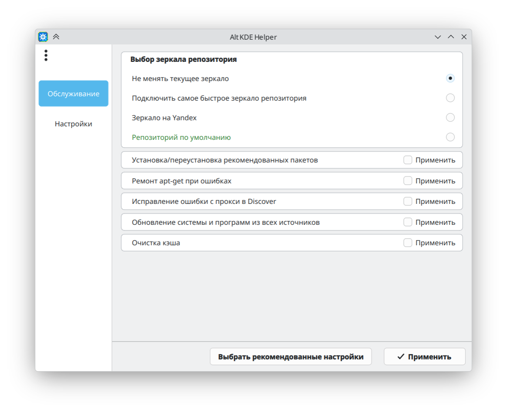
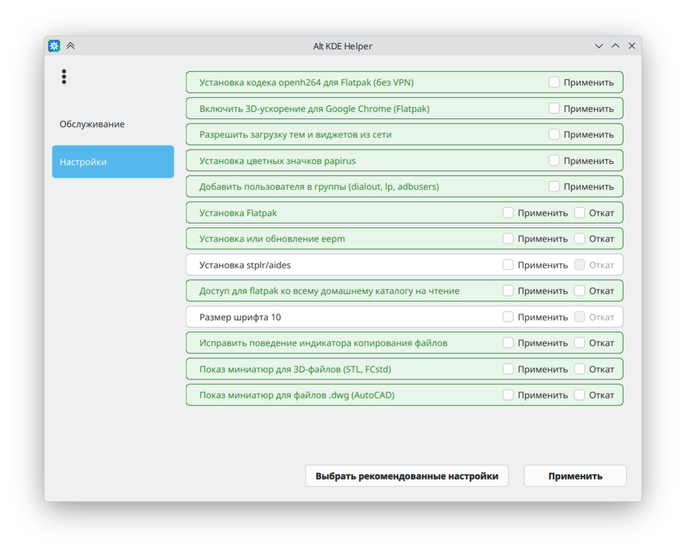

# Alt KDE Helper

## Описание программы

Программа предназначена для настройки и обслуживания операционных систем ALT Linux 11 с рабочим столом KDE6 — KWorkstation и особенно Starterkit, который можно в пару кликов привести в полностью готовый для работы дистрибутив, оставаясь быстрым и лёгким, но полностью функциональным.

**Основные функции:**

- включение отключенных по умолчанию опций (например, загрузку виджетов и тем)
- получение sudo и прав на его использование
- загрузка кодека openh264 без применения VPN
- выбор зеркал репозитория (есть выбор самого быстрого по результатам теста)
- включение создания миниатюр для значков файлов 3D-моделей, FreeCAD и AutoCAD
- установка и удаление дополнительных источников приложений: Flatpak, Stapler (stplr), epm
- обновление самого пакета eepm и программ из epm play
- ремонт apt-get при ошибке базы данных
- исправление ошибки Discover после использования прокси
- доступ для Flatpak ко всему домашнему каталогу на чтение — для возможности перетаскивать файлы мышкой на окно приложения. Это безопасно, так как если программе изначально нужен такой доступ — она его по умолчанию уже имеет
- глубокая очистка кэшей — в домашнем каталоге, для обычных и Flatpak-приложений, удаление старых журналов и сжатие до размера 100 МБ максимум, очистка кэша пакетов (без применения небезопасной опции autoremove), удаление неиспользуемых рантаймов Flatpak, удаление старых ядер
- и другие опции, все показано на скриншотах

При наведении мыши на любой пункт появляется подсказка с описанием действия.

Кнопка **«Выбрать рекомендованные настройки»** одним кликом включает набор настроек, которые обычно делает каждый пользователь после установки системы.

## Скриншоты

## Установка. Сначала обновите систему!

### Самый простой способ — через RPM-пакет

Скачайте файл alt-kde-helper-1.1.1-alt1.noarch.rpm со страницы релизов:
https://github.com/kullibbin-hub/alt-kde-helper/releases/

**Установка через Discover**

Правым кликом по файлу → Открыть с помощью → Discover.

Если в течение нескольких секунд вверху окна не появляется кнопка для установки пакета, посмотрите в меню в верхнем правом углу окна (три точки).

После установки программа появится в меню KDE в разделе "Система".

**Установка через терминал**

1. Положите скачанный файл в вашу домашнюю папку /home/ваш_логин/
2. Откройте терминал и выполните:

   su -

3. Введите пароль root, затем выполните:

apt-get install /home/$(logname)/alt-kde-helper-1.1.1-alt1.noarch.rpm

### Установка из исходников

Скачайте архив с исходным кодом со страницы релизов или через зелёную кнопку Code → Download ZIP. Распакуйте в корень домашнего каталога.

Внутри архива есть скрипты install.sh (для установки) и uninstall.sh (для удаления). Сделайте их исполняемыми и запустите. Konsole откроется автоматически.

## Как пользоваться

1. Выберите нужные действия на вкладках **«Настройки»** и **«Обслуживание»**
2. Нажмите кнопку **«Применить»**
3. Откроется терминал, в котором будут выполняться указанные действия
4. После выполнения всех действий появится сообщение **«Нажмите любую клавишу»**
5. Нажмите любую клавишу или закройте окно терминала
6. Кнопка **«Выбрать рекомендованные настройки»** автоматически включает чекбоксы рекомендуемых автором настроек. При повторном нажатии — чекбоксы снимаются
7. Многие настройки правильно применяются после перезахода в сеанс, а обновления — после перезагрузки компьютера
8. Многие операции требуют ввода пароля в терминале при выполнении. Если появляется надпись  
`[sudo] password for ... (ваш логин)` — требуется ввести ваш пароль. Символы НЕ отображаются, но вводятся! После чего нажать Enter.
9. Подробная справка по работе с программой находится в меню-гамбургере (кнопка с тремя точками в левом верхнем углу). В конце справки указаны текущая версия программы и контактная информация для обратной связи.

## Особенности

- Действия с откатом имеют два чекбокса: **«Применить»** и **«Откат»**
- Откат доступен только после того, как действие было применено
- Выбор зеркала репозитория — радио-кнопки, автоматически удаляет другие варианты из очереди
- **Важно:** Если выбранное зеркало (например, самое быстрое или Yandex) не проходит проверку, автоматически возвращается зеркало по умолчанию — Р11
- sudo устанавливается в процессе установки программы и настраивается для пользователя при первом ее запуске, с подтверждением
- Уже применённое действие выделяется зелёным цветом шрифта, но его можно ещё раз применить при необходимости
- Действие считается примененным только если все пункты этого действия выполнены, подробности в подсказке (по наведению мыши). Если, например, Flatpak установлен, а плагина для Discover нет, то считается, что действие не выполнено, но его можно выполнить еще раз, тогда установятся все пакеты

## Установка драйверов NVIDIA

Инструкция: [https://alt-kde.wiki/graphics/nvidia/nvidia-drivers/](https://alt-kde.wiki/graphics/nvidia/nvidia-drivers/)

Общая вики Alt KDE: [https://alt-kde.wiki/wiki/](https://alt-kde.wiki/wiki/)

Процесс установки драйверов NVIDIA требует ответов на вопросы в терминале и перезагрузки, поэтому в данной программе не реализован.

**Рекомендованный способ из инструкции** — установка через `epm`.

В данной программе `epm` можно установить двумя способами:
- Пункт **«Установка eepm»** (в категории «Настройки»)
- Пункт **«Установка рекомендованных пакетов»** (на вкладке «Настройки»)

В обоих случаях `epm` установится автоматически.

## О программе

- **Автор:** kullibbin
- **Лицензия:** MIT
- **Версия:** 1.1.1
- **Исходный код:** [https://github.com/kullibbin-hub/alt-kde-helper](https://github.com/kullibbin-hub/alt-kde-helper)
- **Обратная связь:** kullibbin@gmail.com
